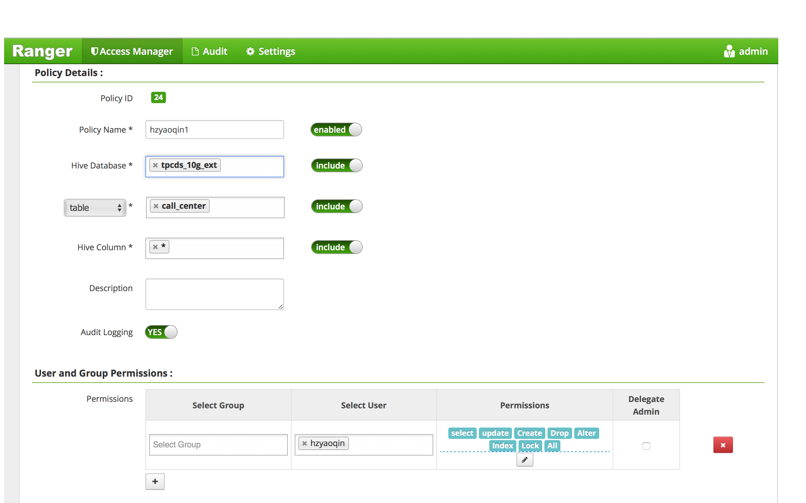

# Spark Authorizer [](https://travis-ci.org/yaooqinn/spark-authorizer) [](http://hits.dwyl.io/yaooqinn/spark-authorizer)

**Spark Authorizer** provides you with *SQL Standard Based Authorization* for [Apache Spark™](http://spark.apache.org) 
as same as [SQL Standard Based Hive Authorization](https://cwiki.apache.org/confluence/display/Hive/SQL+Standard+Based+Hive+Authorization). 
While you are using Spark SQL or Dataset/DataFrame API to load data from tables embedded with [Apache Hive™](https://hive.apache.org) metastore, 
this library provides row/column level fine-grained access controls by [Apache Ranger™](https://ranger.apache.org) or Hive SQL Standard Based Authorization.

Security is one of fundamental features for enterprise adoption. [Apache Ranger™](https://ranger.apache.org) offers many security plugins for many Hadoop ecosystem components, 
such as HDFS, Hive, HBase, Solr and Sqoop2. However, [Apache Spark™](http://spark.apache.org) is not counted in yet. 
When a secured HDFS cluster is used as a data warehouse accessed by various users and groups via different applications wrote by Spark and Hive, 
it is very difficult to guarantee data management in a consistent way.  Apache Spark users visit data warehouse only 
with Storage based access controls offered by HDFS. This library shares [Ranger Hive plugin](https://cwiki.apache.org/confluence/display/RANGER/Apache+Ranger+0.5.0+Installation#ApacheRanger0.5.0Installation-InstallingApacheHive(1.2.0)) 
with Hive to help Spark talking to Ranger Admin. 

Please refer to [ACL Management for Spark SQL](https://yaooqinn.github.io/spark-authorizer/docs/spark_sql_authorization.html) to see what spark-authorizer supports.


## Build

Refer to [Building Spark Authorizer](https://yaooqinn.github.io/spark-authorizer/docs/building-spark-authorizer.html)


## Quick Start

  1. `cp spark-authorizer-<version>.jar $SPARK_HOME/jars`(only required when manually build this)
  2. [install ranger-hive-plugin for spark](https://yaooqinn.github.io/spark-authorizer/docs/install_plugin.html)
  3. configure you `hive-site.xml` and other ranger configuration files, you may find an sample in `[./conf]`
  4. set `spark.sql.extensions`=`org.apache.ranger.authorization.spark.authorizer.RangerSparkSQLExtension`

**NOTE** the 4th step works for Spark 2.2.x and later, for please check the previous doc for Spark 2.1.x.

## Interactive Spark Shell

The easiest way to start using Spark is through the Scala shell:

```shell
bin/spark-shell --master yarn --proxy-user hzyaoqin
```

## Suffer for the Authorization Pain 

We create a ranger policy as below:


Check Privilage with some simple cases.

#### Show databases

```sql
scala> spark.sql("show databases").show
+--------------+
|  databaseName|
+--------------+
|       default|
| spark_test_db|
| tpcds_10g_ext|
+--------------+
```

### Switch database

```sql
scala> spark.sql("use spark_test_db").show
17/12/08 17:06:17 ERROR optimizer.Authorizer:
+===============================+
|Spark SQL Authorization Failure|
|-------------------------------|
|Permission denied: user [hzyaoqin] does not have [USE] privilege on [spark_test_db]
|-------------------------------|
|Spark SQL Authorization Failure|
+===============================+
```
Oops...


```sql
scala> spark.sql("use tpcds_10g_ext").show
++
||
++
++
```
LOL...


### Select 
```sql
scala> spark.sql("select cp_type from catalog_page limit 1").show
17/12/08 17:09:58 ERROR optimizer.Authorizer:
+===============================+
|Spark SQL Authorization Failure|
|-------------------------------|
|Permission denied: user [hzyaoqin] does not have [SELECT] privilege on [tpcds_10g_ext/catalog_page/cp_type]
|-------------------------------|
|Spark SQL Authorization Failure|
+===============================+
```
Oops...

```sql
scala> spark.sql("select * from call_center limit 1").show
+-----------------+-----------------+-----------------+---------------+-----------------+---------------+--------+--------+------------+--------+--------+-----------+---------+--------------------+--------------------+-----------------+-----------+----------------+----------+---------------+----------------+--------------+--------------+---------------+-------+-----------------+--------+------+-------------+-------------+-----------------+
|cc_call_center_sk|cc_call_center_id|cc_rec_start_date|cc_rec_end_date|cc_closed_date_sk|cc_open_date_sk| cc_name|cc_class|cc_employees|cc_sq_ft|cc_hours| cc_manager|cc_mkt_id|        cc_mkt_class|         cc_mkt_desc|cc_market_manager|cc_division|cc_division_name|cc_company|cc_company_name|cc_street_number|cc_street_name|cc_street_type|cc_suite_number|cc_city|        cc_county|cc_state|cc_zip|   cc_country|cc_gmt_offset|cc_tax_percentage|
+-----------------+-----------------+-----------------+---------------+-----------------+---------------+--------+--------+------------+--------+--------+-----------+---------+--------------------+--------------------+-----------------+-----------+----------------+----------+---------------+----------------+--------------+--------------+---------------+-------+-----------------+--------+------+-------------+-------------+-----------------+
|                1| AAAAAAAABAAAAAAA|       1998-01-01|           null|             null|        2450952|NY Metro|   large|           2|    1138| 8AM-4PM|Bob Belcher|        6|More than other a...|Shared others cou...|      Julius Tran|          3|             pri|         6|          cally|             730|      Ash Hill|     Boulevard|        Suite 0| Midway|Williamson County|      TN| 31904|United States|        -5.00|             0.11|
+-----------------+-----------------+-----------------+---------------+-----------------+---------------+--------+--------+------------+--------+--------+-----------+---------+--------------------+--------------------+-----------------+-----------+----------------+----------+---------------+----------------+--------------+--------------+---------------+-------+-----------------+--------+------+-------------+-------------+-----------------+

```

LOL...

### Dataset/DataFrame

```scala
scala> spark.read.table("catalog_page").limit(1).collect
```
```
17/12/11 14:46:33 ERROR optimizer.Authorizer:
+===============================+
|Spark SQL Authorization Failure|
|-------------------------------|
|Permission denied: user [hzyaoqin] does not have [SELECT] privilege on [tpcds_10g_ext/catalog_page/cp_catalog_page_sk,cp_catalog_page_id,cp_promo_id,cp_start_date_sk,cp_end_date_sk,cp_department,cp_catalog_number,cp_catalog_page_number,cp_description,cp_type]
|-------------------------------|
|Spark SQL Authorization Failure|
+===============================+
```
Oops...

```scala
scala> spark.read.table("call_center").limit(1).collect
```
```
res3: Array[org.apache.spark.sql.Row] = Array([1,AAAAAAAABAAAAAAA,1998-01-01,null,null,2450952,NY Metro,large,2,1138,8AM-4PM,Bob Belcher,6,More than other authori,Shared others could not count fully dollars. New members ca,Julius Tran,3,pri,6,cally,730,Ash Hill,Boulevard,Suite 0,Midway,Williamson County,TN,31904,United States,-5.00,0.11])
```
LOL...

---
